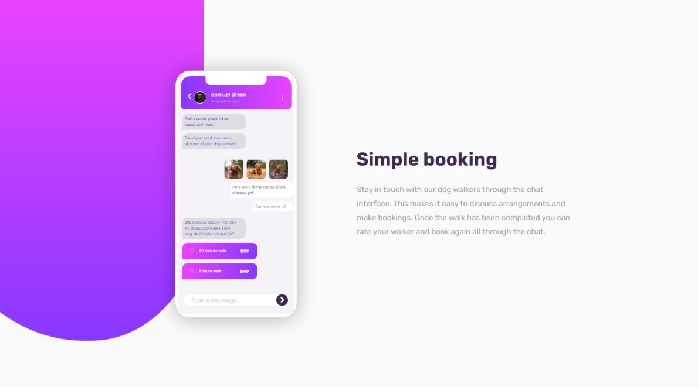

# FM-Chat-App-Css-Illustration-Master
Frontend Mentor | Chat App Css Illustration Master

# Frontend Mentor - Chat app CSS illustration solution

This is a solution to the [Chat app CSS illustration challenge on Frontend Mentor](https://www.frontendmentor.io/challenges/chat-app-css-illustration-O5auMkFqY). Frontend Mentor challenges help you improve your coding skills by building realistic projects. 

## Table of contents

- [Overview](#overview)
  - [The challenge](#the-challenge)
  - [Screenshot](#screenshot)
  - [Links](#links)
- [My process](#my-process)
  - [Built with](#built-with)
- [Author](#author)

## Overview

### The challenge

Users should be able to:

- View the optimal layout for the component depending on their device's screen size
- **Bonus**: See the chat interface animate on the initial load

### Screenshot

<figure>
  
</figure>

### Links

- Solution URL: [GitHub](https://github.com/abdellah-abadou/FM-Chat-App-Css-Illustration-Master)
- Live Site URL: [Preview](https://fm-chat-app-css-illustration-master.netlify.app/)

## My process

I declared that I did not like the challenge very much. I ignored many details just to finish this project

### Built with

- Semantic HTML5 markup
- CSS custom properties
- Flexbox
- CSS Grid

## Author

- Frontend Mentor - [@abdellah-abadou](https://www.frontendmentor.io/profile/abdellah-abadou)

